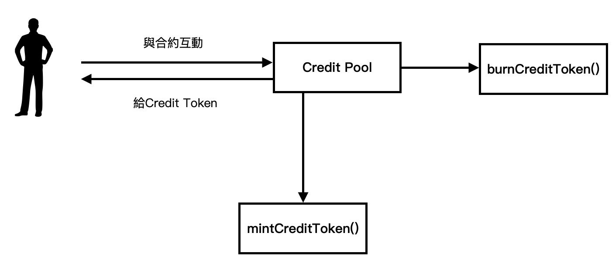
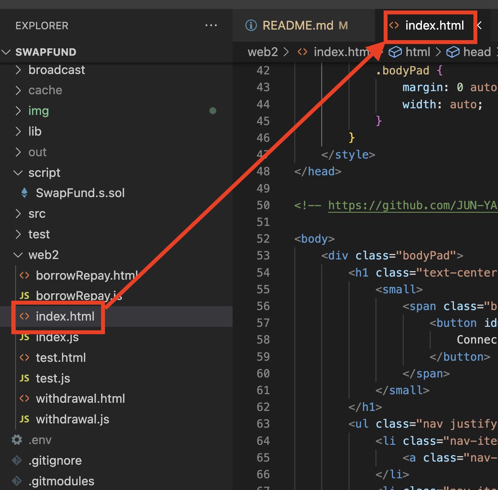
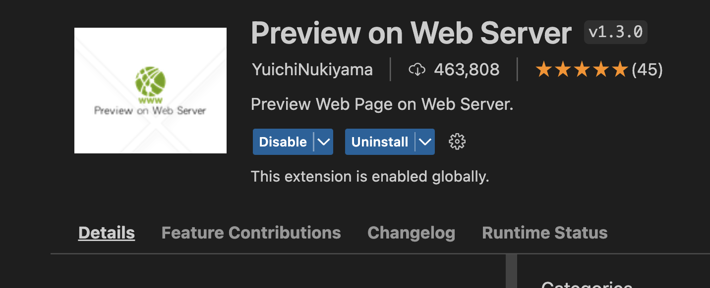
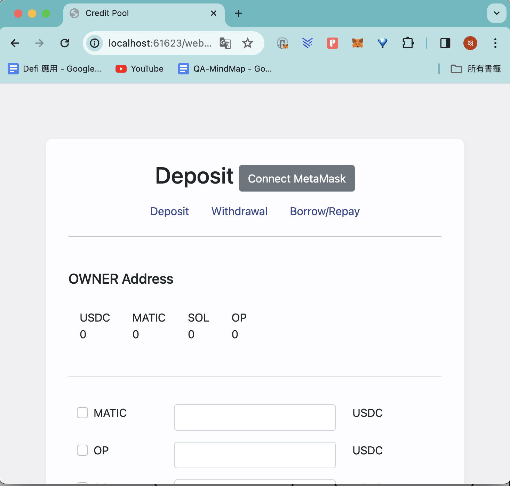

# Credit Pool

## Description

區塊鏈是匿名的世界，很自由但也沒有任何人可以信任，因此在借貸時最常見的會要超額抵押。因此此專案是要解決不用超額抵押就可以借到大量的資金。為每個地址建立信用積分，只要頻繁跟此Credit Pool互動，就會獲得平台代幣，來獲得大量信用積分，越多積分的地址，在進行借貸時可以用更少量的抵押品借到更多的錢。

### what - Credit Pool 是什麼？
借貸協議，提供存錢、換幣、借貸等功能。

### why - 為什麼要做Credit Pool?
解決超額抵押問題、有互動就有獎勵。

### how - 如何做到？
信用積分的設計。

## Framework

### CriditPool合約繼承ERC20
透過ERC20鑄造平台幣，只要跟此平台互動，像是deposit、withdrawal、borrow、repay，就可以獲得平台幣Credit Token CT。但如果被清算CT就會被燒掉。

credit pool是互動合約，鑄造CT是mintCreditToken。
燒毀是burnCreditToken方法。

### 存入token，增加流動性

### 存入token，增加流動性，同時清算壞帳

### 提領任一token

### 借貸

### 還款

## Development

使用Foundry作為開發以及測試環境。

git clone https://github.com/JUN-YAO-LIU/SwapFund.git

**建置**
step 1.
$forge build

**UI測試**
可以用VS Code 進行前端測試。

step 1.
開啟web2資料夾 -> 選取index.html

step 2.
安裝vs code套件 Preview on Web Server

step 3. 開啟localhost/web2/index.html 前端畫面
control + shift + L

## Testing
step 1.
$forge test

## Usage