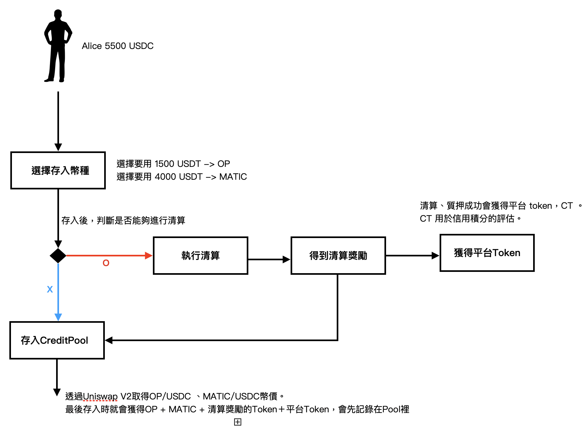
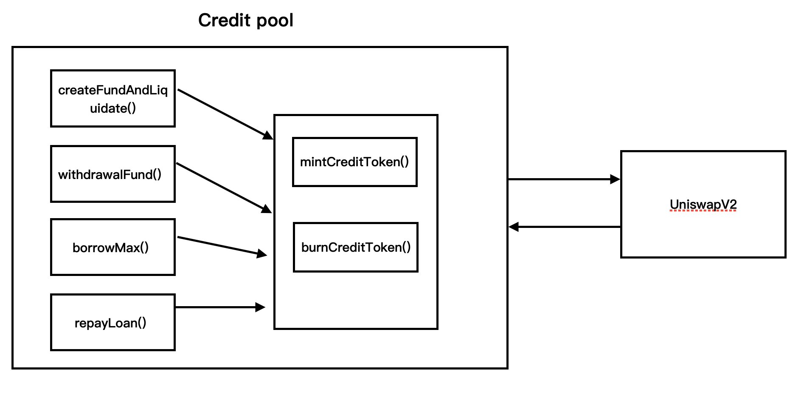
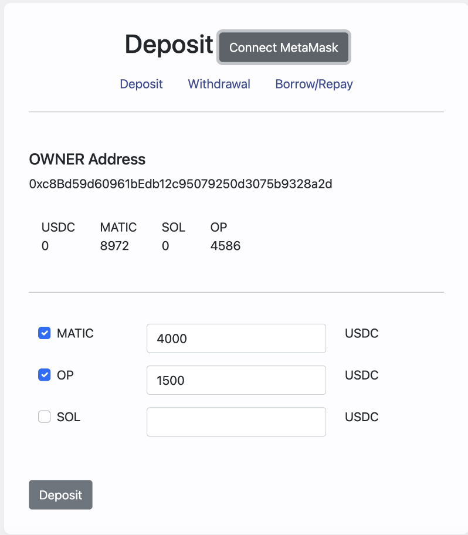
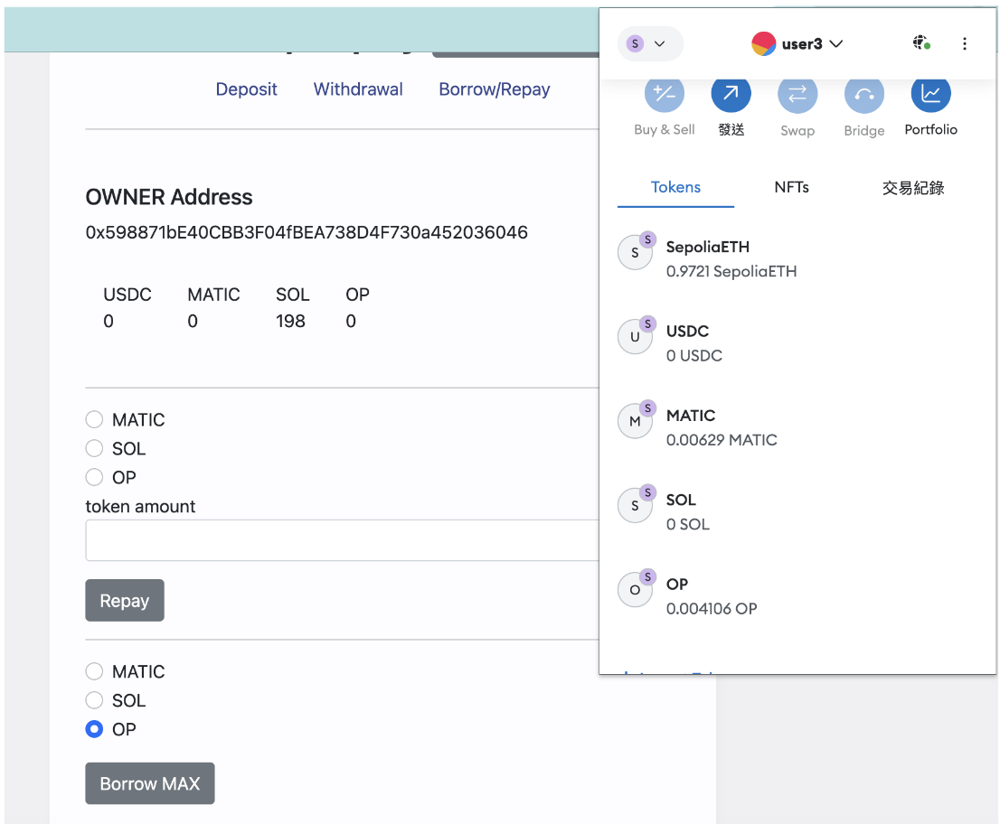
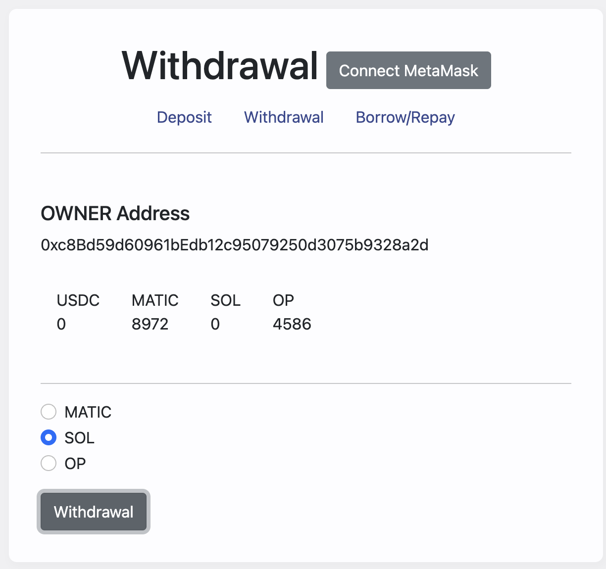

# Credit Pool

## Description

區塊鏈是匿名的世界，很自由但也沒有任何人可以信任，因此在借貸時最常見的會要超額抵押。因此此專案是要解決不用超額抵押就可以借到大量的資金。為每個地址建立信用積分，只要頻繁跟此Credit Pool互動，就會獲得平台代幣，來獲得大量信用積分，越多積分的地址，在進行借貸時可以用更少量的抵押品借到更多的錢。

### what - Credit Pool 是什麼？
借貸協議，提供存錢、換幣、借貸等功能。

### why - 為什麼要做Credit Pool?
解決超額抵押問題、有互動就有獎勵。

### how - 如何做到？
信用積分的設計。

### 流程

## Framework

### CriditPool合約繼承ERC20
透過ERC20鑄造平台幣，只要跟此平台互動，像是deposit、withdrawal、borrow、repay，就可以獲得平台幣Credit Token CT。但如果被清算CT就會被燒掉。

credit pool是互動合約，鑄造CT是mintCreditToken。
燒毀是burnCreditToken方法。

### 主要方法模組之間關係

1. 兌換token、取得幣價，是由UniswapV2取得，所以Credit Pool跟Uniswap會有密切關係。
2. 主要的方法createFundAndLiquidate、withdrawalFund、borrowMax、repayLoan，都是User跟合約互動的主要的方法，有互動就可以獲得平台幣，所以這些方發會跟mintCreditToken、burnCreditToken方法有關係。

**createFundAndLiquidate**
Usdc，選擇想存入的token類型及數量進行存入並增加流動性，同時清算壞帳。

**withdrawalFund**
提領時，只能提領單一幣種，並且只要在Pool裡面有足夠的該token則無手續費。

範例：存入tokneA tokenB，提領時可以提領TokenC，達到免手續費換幣的效果。

**borrowMax**
目前設定，當你存入token到pool裡時，才能進行借貸，且只能選擇單一token借貸，而且會一次幫你借出最多數量。

**repayLoan**
還款的方法。

## Development

使用Foundry作為開發以及測試環境。

git clone https://github.com/JUN-YAO-LIU/SwapFund.git

**建置**
step 1.
$forge build

## Testing
step 1.
$forge test

## Usage

**UI測試**
可以用VS Code 進行前端測試。

step 1.
開啟web2資料夾 -> 選取index.html

step 2.
安裝vs code套件 Preview on Web Server

step 3. 開啟localhost/web2/index.html 前端畫面
control + shift + L

**存入角色**
1. 準備USDC
2. 選擇存入時兌換的幣種及數量
3. 存入

**借貸角色**
1. pool裡要有存入的資產
2. 選擇要借出幣種
3. 同一頁，有還款功能

**提領角色**
1. 選擇要提領的幣種
